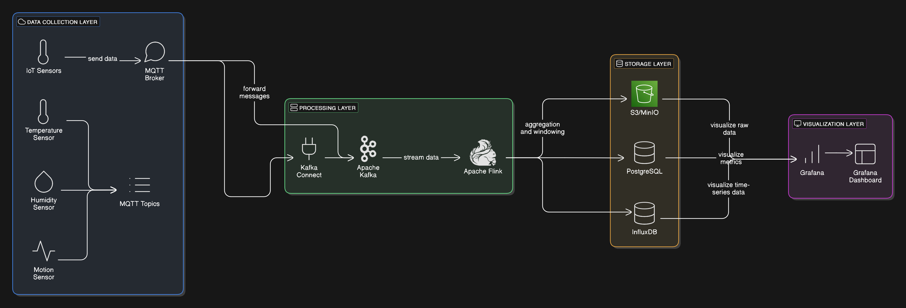
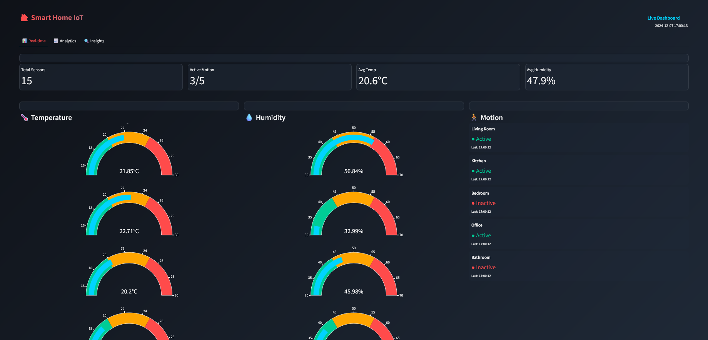
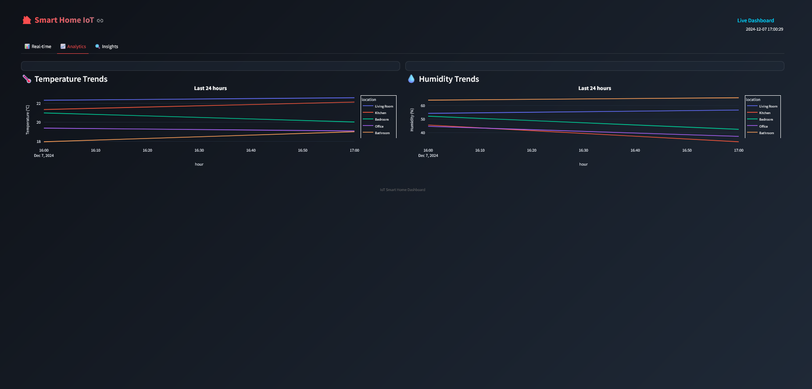
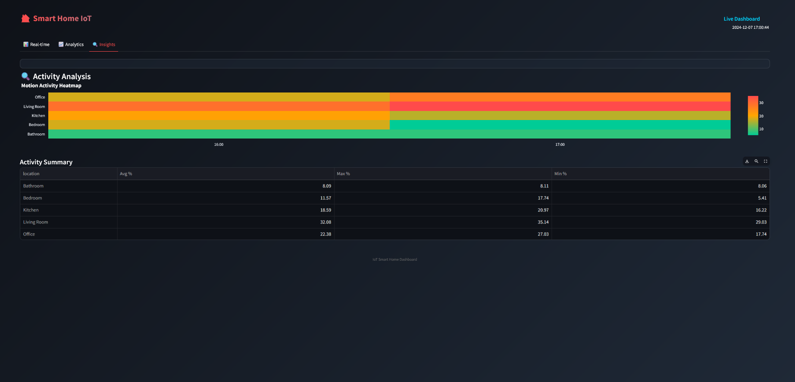
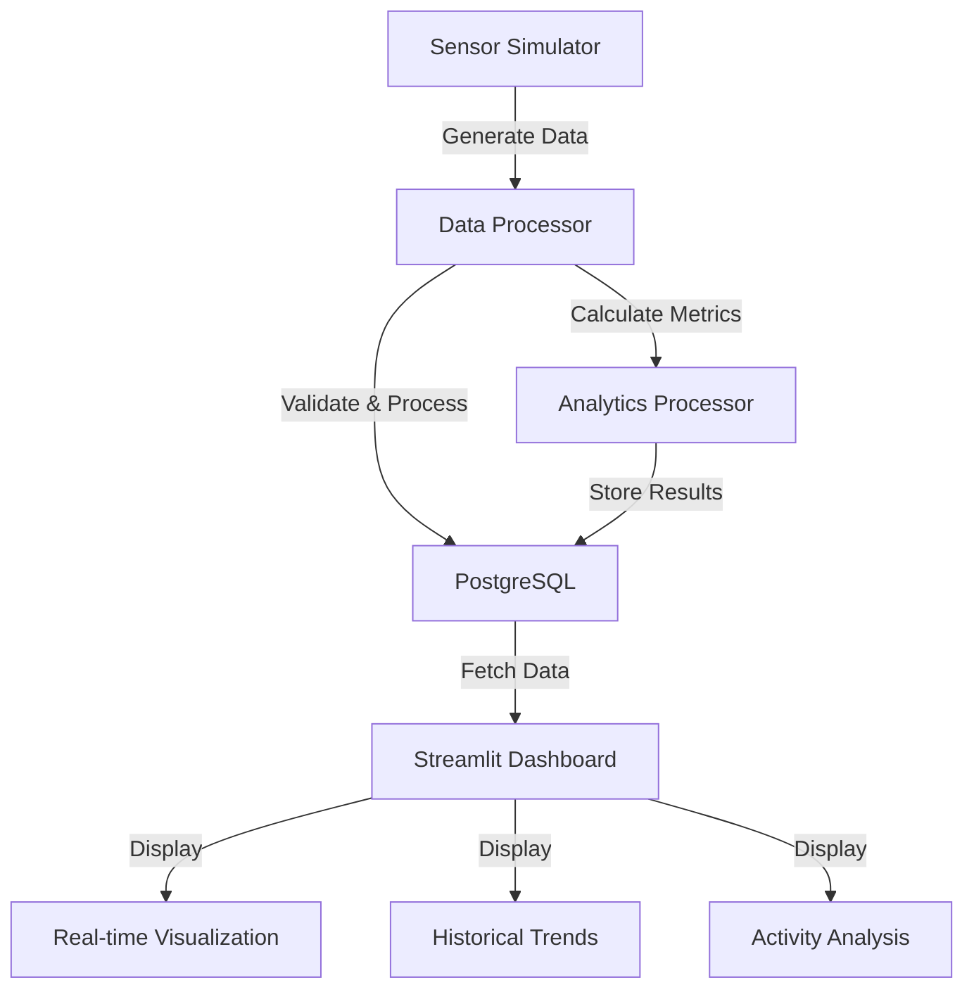

# 🏠 IoT Smart Home Data Pipeline

<div align="center">

[](https://www.python.org/)
[](https://www.postgresql.org/)
[](https://streamlit.io/)
[](https://www.docker.com/)

A sophisticated real-time data pipeline system for smart home sensor analytics, featuring stream processing, efficient storage, and beautiful visualization capabilities.

<!-- Architecture -->


[Getting Started](#-quick-start) •
[Features](#-key-features) •
[Architecture](#-architecture) •
[Documentation](#-documentation) •
[Contributing](#-contributing)

</div>

---

## 📌 Table of Contents

- [Overview](#-overview)
- [Key Features](#-key-features)
- [Technology Stack](#%EF%B8%8F-technology-stack)
- [Quick Start](#-quick-start)
- [Architecture](#-architecture)
- [Project Structure](#-project-structure)
- [Development](#-development)
- [Deployment](#-deployment)
- [Monitoring](#-monitoring)
- [Security](#%EF%B8%8F-security)
- [Troubleshooting](#-troubleshooting)
- [Contributing](#-contributing)
- [License](#-license)

## 🎯 Overview

This project implements an enterprise-grade IoT data pipeline that processes and analyzes smart home sensor data in real-time. It demonstrates modern data engineering practices and cloud-native architectures.

### Use Cases
- **Home Automation**: Trigger actions based on sensor readings
- **Energy Optimization**: Track and optimize energy consumption
- **Security Monitoring**: Motion detection and alert system
- **Climate Control**: Temperature and humidity monitoring
- **Predictive Maintenance**: Early detection of system anomalies

## ✨ Key Features

<table>
<tr>
<td>

### 🔄 Real-time Processing
- Sub-second data processing latency
- Complex event processing (CEP)
- Windowed aggregations
- Pattern detection

### 📊 Analytics
- Historical trend analysis
- Predictive analytics
- Anomaly detection
- Custom metrics calculation

</td>
<td>

### 🔒 Security
- End-to-end encryption
- Authentication & Authorization
- Audit logging
- Secure data storage

### �� Scalability
- Horizontal scaling
- Load balancing
- High availability
- Fault tolerance

</td>
</tr>
</table>

## 🛠️ Technology Stack

<details>
<summary><b>Data Collection Layer</b></summary>

- **IoT Sensors**: 
  - Python-based sensor simulators
  - Temperature, humidity, and motion sensors
  - Configurable data generation rates
  - Realistic data patterns
</details>

<details>
<summary><b>Processing Layer</b></summary>

- **Stream Processing**:
  - Real-time data processing
  - Windowed aggregations
  - Custom metrics calculation
  - Event pattern detection

- **Analytics Engine**:
  - Time-window operations
  - Statistical aggregations
  - Event pattern detection
  - Anomaly detection
</details>

<details>
<summary><b>Storage Layer</b></summary>

- **Relational Data**:
  - PostgreSQL 15
  - Partitioned tables for efficient storage
  - Sensor metadata and readings
  - Aggregated metrics
  - Event history
</details>

<details>
<summary><b>Visualization Layer</b></summary>

- **Dashboards**:
  - Streamlit
  - Real-time sensor metrics
  - Historical trends
  - Interactive visualizations
  - Beautiful modern UI
</details>

## 🚀 Quick Start

### Prerequisites

```bash
# Check Docker version
docker --version  # Required: 20.10.0 or higher

# Check Python version
python --version  # Required: 3.8 or higher
```

### Installation

1. Clone the repository:
```bash
git clone <repository-url>
cd iot-smart-home-pipeline
```

2. Create and activate a virtual environment:
```bash
python -m venv venv
source venv/bin/activate  # Linux/Mac
.\venv\Scripts\activate   # Windows
```

3. Install dependencies:
```bash
pip install -r requirements.txt
```

4. Copy the environment file and modify as needed:
```bash
cp .env.example .env
```

5. Start PostgreSQL:
```bash
docker-compose up -d
```

6. Set up the database:
```bash
python scripts/setup_superuser.py
python scripts/setup_database.py
```

### Running the Pipeline

1. Start the main data pipeline:
```bash
python src/main.py
```

2. Start the dashboard:
```bash
streamlit run src/visualization/dashboard.py
```

3. Access the services:
- Streamlit Dashboard: http://localhost:8501
- PostgreSQL: localhost:5432

### Dashboard

| Real-time Monitoring | Analytics View | Insights Dashboard |
|:---:|:---:|:---:|
|  |  |  |

## 📐 Common Commands

### Environment Setup
bash
# Create and activate virtual environment
python -m venv venv
.\venv\Scripts\activate   # Windows
source venv/bin/activate  # Linux/Mac

# Install dependencies
pip install -r requirements.txt
```

### Docker Commands
```bash
# Start PostgreSQL
docker-compose up -d

# Stop PostgreSQL
docker-compose down

# View logs
docker-compose logs -f postgres

# Check service status
docker-compose ps
```

### Database Commands
```bash
# PostgreSQL
psql -h localhost -U iot_user -d iot_db    # Connect to PostgreSQL
\dt                                        # List tables
\d+ table_name                            # Describe table with details
\d+ temperature_readings                   # View temperature table partitions
\q                                        # Quit psql

# Common Queries
SELECT COUNT(*) FROM temperature_readings; # Count temperature readings
SELECT COUNT(*) FROM humidity_readings;    # Count humidity readings
SELECT COUNT(*) FROM motion_events;        # Count motion events
```

### Application Commands
```bash
# Initial setup
python scripts/setup_superuser.py          # Create database and user
python scripts/setup_database.py           # Create tables and partitions

# Run the pipeline
python src/main.py                         # Start data generation and processing

# Start the dashboard
streamlit run src/visualization/dashboard.py

# Run tests
python scripts/test_database.py            # Test database setup
python scripts/test_inserts.py             # Test data insertion
python scripts/check_partitions.py         # Check partition boundaries
python scripts/test_query_performance.py   # Test query performance
```

### Service Access
```plaintext
Streamlit Dashboard: http://localhost:8501
PostgreSQL:         localhost:5432
```

## 📐 Architecture

### System Components

Our system consists of four main components:

1. **Data Generation**
   - Simulated IoT sensors for temperature, humidity, and motion
   - Configurable number of sensors and data generation rates
   - Realistic data patterns with customizable ranges

2. **Data Processing**
   - Real-time data validation and processing
   - Efficient batch processing of sensor readings
   - Analytics processing for aggregated metrics
   - Pipeline monitoring and health checks

3. **Data Storage**
   - PostgreSQL with table partitioning for efficient storage
   - Separate partitions for different time ranges
   - Optimized indexes for query performance
   - Proper data retention management

4. **Data Visualization**
   - Modern Streamlit dashboard with dark theme
   - Real-time sensor readings with gauge charts
   - Historical trends with interactive plots
   - Activity analysis with heatmaps
   - System health monitoring

### Data Flow


## 📊 Dashboard Features

### Real-time Monitoring
- Live sensor readings with gauge charts
- Current status indicators
- System health metrics
- Active sensor count

### Analytics Views
- Temperature and humidity trends
- Motion activity patterns
- Min/Max analysis
- Statistical distributions

### Interactive Controls
- Adjustable refresh rate
- Configurable time windows
- Toggle-able visualizations
- Custom display options

### Modern UI Elements
- Dark theme with gradient accents
- Glass-morphism design
- Responsive layouts
- Interactive charts

## 🔧 Troubleshooting

### Common Issues

1. **Database Connection Issues**
```bash
# Check PostgreSQL service
docker-compose ps postgres

# Check database logs
docker-compose logs postgres

# Test connection
psql -h localhost -U iot_user -d iot_db
```

2. **Data Pipeline Issues**
```bash
# Check main.py logs
python src/main.py 2>&1 | tee pipeline.log

# Monitor data insertion
watch -n 1 'psql -h localhost -U iot_user -d iot_db -c "SELECT COUNT(*) FROM temperature_readings"'
```

3. **Dashboard Issues**
```bash
# Clear Streamlit cache
streamlit cache clear

# Run with debug logging
streamlit run src/visualization/dashboard.py --logger.level=debug
```

## 📈 Performance Optimization

### Database Optimization
- Table partitioning by timestamp
- Appropriate indexes for common queries
- Regular vacuum and analyze
- Connection pooling

### Query Optimization
```sql
-- Use partitioned tables
SELECT * FROM temperature_readings 
WHERE timestamp >= NOW() - INTERVAL '1 hour';

-- Utilize indexes
CREATE INDEX idx_temp_timestamp 
ON temperature_readings USING BRIN(timestamp);

-- Efficient aggregations
SELECT 
    date_trunc('hour', timestamp) as hour,
    AVG(value) as avg_temp
FROM temperature_readings
GROUP BY 1
ORDER BY 1;
```

### Pipeline Optimization
- Batch processing for efficiency
- Configurable update intervals
- Memory-efficient data handling
- Error handling and retries

```## 📁 Project Structure

iot-smart-home-pipeline/
├── 📂 .github/            # GitHub Actions workflows
├── 📂 docker/             # Containerization
│   ├── kafka/
│   ├── flink/
│   └── grafana/
├── 📂 docs/               # Documentation
│   ├── architecture.png
│   └── api-specs/
├── 📂 src/                # Source code
│   ├── simulator/         # IoT sensor simulator
│   ├── processors/        # Flink jobs
│   └── connectors/        # Custom connectors
├── 📂 tests/              # Test suites
├── 📂 config/             # Configuration files
├── 📂 scripts/            # Utility scripts
└── 📂 monitoring/         # Monitoring setup
```

## 💻 Development

### Code Style
```bash
# Format code
black src/
isort src/

# Lint code
flake8 src/
mypy src/
```

### Testing Strategy
- Unit Tests: `pytest tests/unit/`
- Integration Tests: `pytest tests/integration/`
- Load Tests: `locust -f tests/load/locustfile.py`

### Local Development
```bash
# Start development environment
docker-compose -f docker-compose.dev.yml up -d

# Hot reload for development
./scripts/dev-reload.sh
```

## 🌐 Deployment

### Production Deployment
```bash
# Build production images
docker-compose -f docker-compose.prod.yml build

# Deploy stack
docker stack deploy -c docker-compose.prod.yml iot-pipeline
```

### Cloud Deployment
- AWS CloudFormation templates in `deploy/aws/`
- Azure ARM templates in `deploy/azure/`
- GCP Deployment Manager configs in `deploy/gcp/`

## 📊 Monitoring

### Grafana Dashboards

<details>
<summary>Available Dashboards</summary>

1. **System Overview**
   - CPU, Memory, Disk usage
   - Network I/O
   - Container health

2. **Sensor Metrics**
   - Temperature heatmaps
   - Humidity trends
   - Motion detection events

3. **Pipeline Performance**
   - Processing latency
   - Throughput metrics
   - Error rates
</details>

### Alerting Rules

```yaml
alerts:
  - name: high_temperature
    condition: temp > 30°C
    duration: 5m
    
  - name: system_latency
    condition: latency > 1s
    duration: 2m
```

## 🛡️ Security

### Security Features
- TLS 1.3 encryption
- OAuth 2.0 authentication
- Role-based access control
- Audit logging

### Best Practices
1. Regular security updates
2. Secrets management
3. Network segmentation
4. Access control policies

## 🔧 Contributing

We welcome contributions! Please see our [Contributing Guide](CONTRIBUTING.md) for details.

### Development Process
1. Fork the repository
2. Create your feature branch
   ```bash
   git checkout -b feature/amazing-feature
   ```
3. Commit your changes
   ```bash
   git commit -m 'Add amazing feature'
   ```
4. Push to the branch
   ```bash
   git push origin feature/amazing-feature
   ```
5. Open a Pull Request

## 📄 License

This project is licensed under the MIT License - see the [LICENSE](LICENSE) file for details.

 
